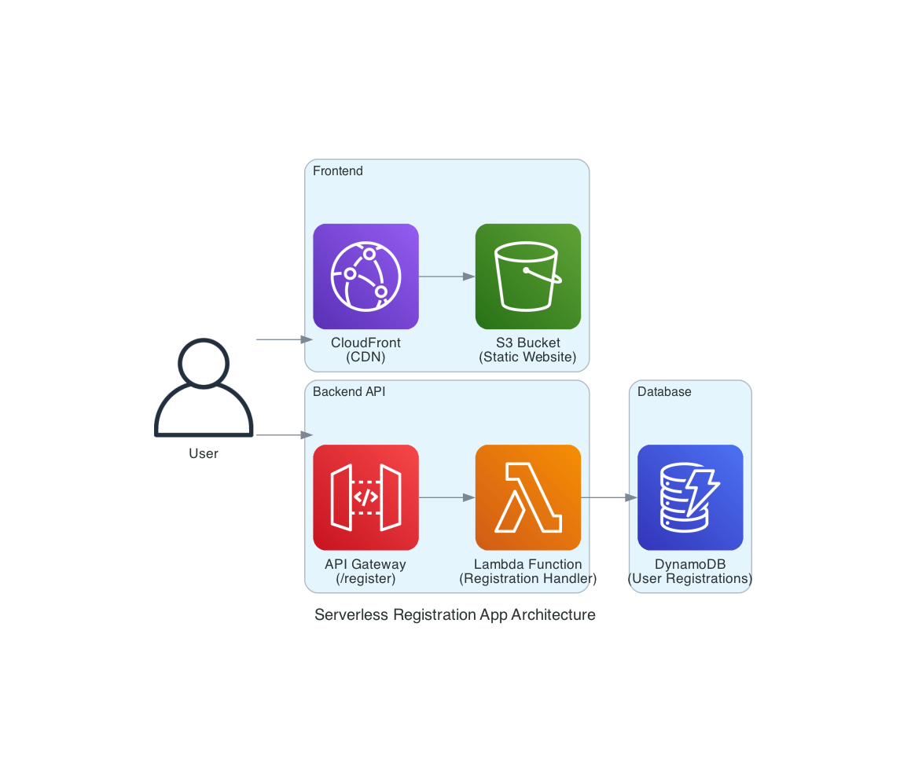

# Registration App - Architecture Documentation

## Overview
A serverless registration application built on AWS using modern cloud-native services for maximum scalability, cost-efficiency, and minimal operational overhead.



## Architecture Components

### Frontend Layer
- **Amazon S3**: Static website hosting for the registration form
- **Amazon CloudFront**: Global CDN for fast content delivery and HTTPS termination

### API Layer
- **Amazon API Gateway**: RESTful API endpoint with CORS support
- **AWS Lambda**: Serverless function handling registration logic

### Data Layer
- **Amazon DynamoDB**: NoSQL database storing user registration data

## Data Flow

1. **User Access**: User accesses the registration form via CloudFront CDN
2. **Form Submission**: JavaScript submits form data to API Gateway endpoint
3. **Processing**: Lambda function validates and processes the registration
4. **Storage**: User data is stored in DynamoDB table
5. **Response**: Success/error response returned to the user

## Technical Specifications

### DynamoDB Schema
```
Table: UserRegistrations
Partition Key: email (String)
Attributes:
- firstName (String)
- lastName (String)
- phone (String)
- birthDate (String)
- gender (String)
- newsletter (Boolean)
- createdAt (String - ISO timestamp)
```

### API Endpoints
```
POST /register
- Content-Type: application/json
- CORS enabled for all origins
- Request validation included
```

### Lambda Function
- **Runtime**: Node.js 20.x
- **Memory**: 128 MB (default)
- **Timeout**: 30 seconds
- **Environment**: TABLE_NAME variable

## Scalability & Performance

### Auto-Scaling
- **Lambda**: Handles up to 1,000 concurrent executions by default
- **DynamoDB**: Pay-per-request billing with automatic scaling
- **CloudFront**: Global edge locations for low latency

### Performance Metrics
- **Cold Start**: ~100ms for Lambda
- **API Response**: <200ms typical
- **Global Latency**: <100ms via CloudFront

## Security Features

### Data Protection
- **HTTPS**: Enforced via CloudFront
- **CORS**: Configured for secure cross-origin requests
- **IAM**: Least privilege access for Lambda to DynamoDB

### Input Validation
- **Client-side**: JavaScript form validation
- **Server-side**: Lambda function data validation
- **Email**: Unique constraint via DynamoDB partition key

## Cost Analysis

### Monthly Estimates (Low Traffic)
| Service | Usage | Cost |
|---------|-------|------|
| DynamoDB | 1K requests | $0.25 |
| Lambda | 1K invocations | Free Tier |
| API Gateway | 1K requests | $0.004 |
| S3 | 1GB storage | $0.023 |
| CloudFront | 1GB transfer | $0.085 |
| **Total** | | **~$0.36/month** |

### Scaling Costs
- **10K requests/month**: ~$3.50
- **100K requests/month**: ~$35
- **1M requests/month**: ~$350

## Deployment

### Prerequisites
```bash
npm install
npx cdk bootstrap  # First time only
```

### Deploy Infrastructure
```bash
npm run deploy
```

### Update API URL
After deployment, update the `API_URL` in `website/registration.html` with the output URL, then redeploy.

## Monitoring & Observability

### Built-in Monitoring
- **CloudWatch Logs**: Lambda function logs
- **CloudWatch Metrics**: API Gateway and Lambda metrics
- **DynamoDB Metrics**: Read/write capacity and throttling

### Key Metrics to Monitor
- API Gateway 4xx/5xx errors
- Lambda duration and errors
- DynamoDB throttled requests
- CloudFront cache hit ratio

## Disaster Recovery

### Data Backup
- **DynamoDB**: Point-in-time recovery enabled
- **S3**: Versioning and cross-region replication available
- **Infrastructure**: CDK code in version control

### Recovery Time
- **RTO**: <5 minutes (redeploy from CDK)
- **RPO**: <1 minute (DynamoDB point-in-time recovery)

## Future Enhancements

### Phase 2 Features
- User authentication with Amazon Cognito
- Email verification via Amazon SES
- Advanced form validation
- Admin dashboard for user management

### Scaling Considerations
- Add Amazon ElastiCache for session management
- Implement Amazon SQS for async processing
- Add Amazon RDS for complex queries
- Use AWS WAF for additional security

## Maintenance

### Regular Tasks
- Monitor CloudWatch dashboards
- Review cost optimization recommendations
- Update Lambda runtime versions
- Rotate IAM credentials

### Automated Updates
- CDK handles infrastructure updates
- Lambda automatically patches runtime
- DynamoDB manages scaling automatically

## Support & Troubleshooting

### Common Issues
1. **CORS Errors**: Verify API Gateway CORS configuration
2. **Lambda Timeouts**: Check function duration in CloudWatch
3. **DynamoDB Throttling**: Monitor read/write capacity metrics

### Debug Steps
1. Check CloudWatch Logs for Lambda errors
2. Verify API Gateway request/response in console
3. Test DynamoDB permissions with AWS CLI
4. Validate form data format in browser console